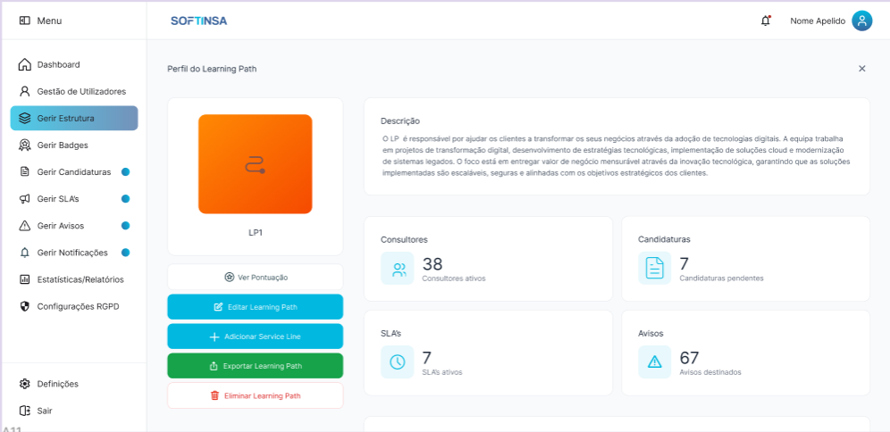
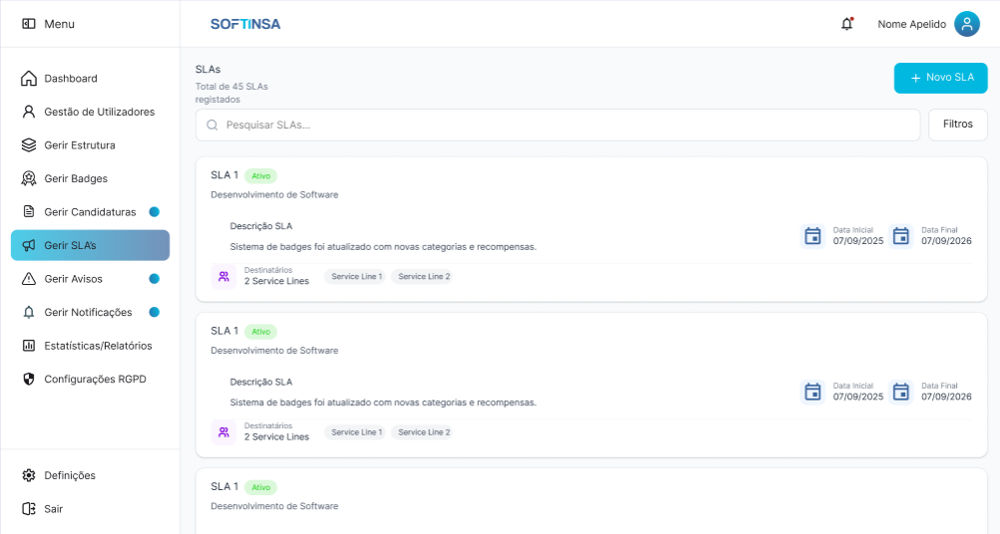
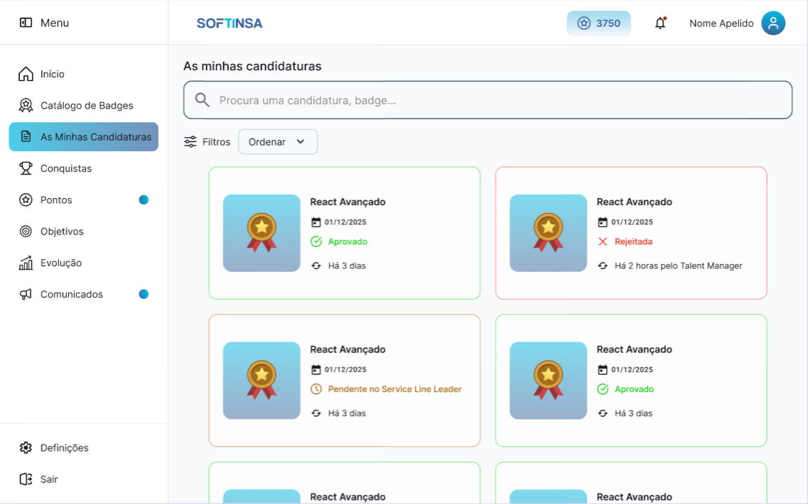
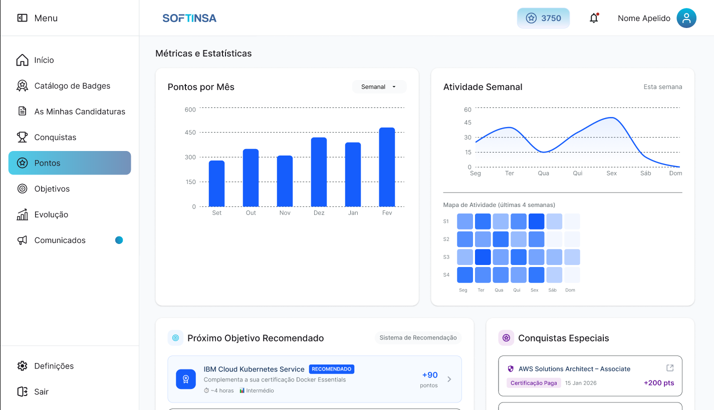
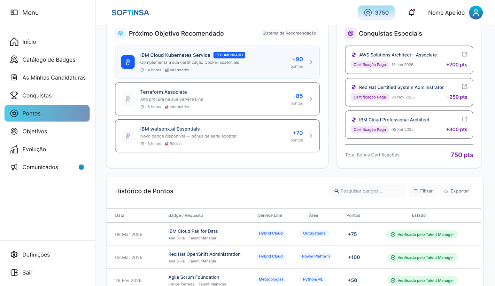
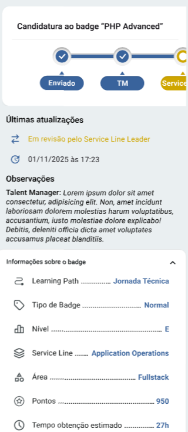
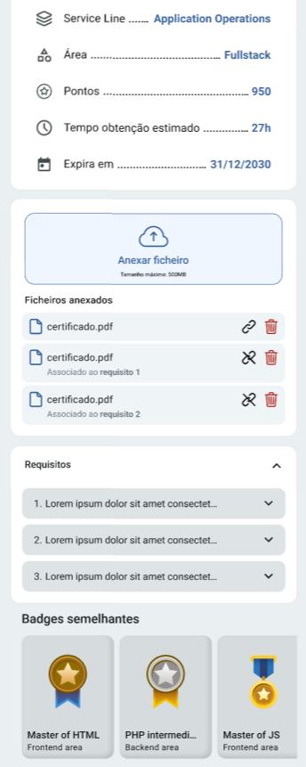
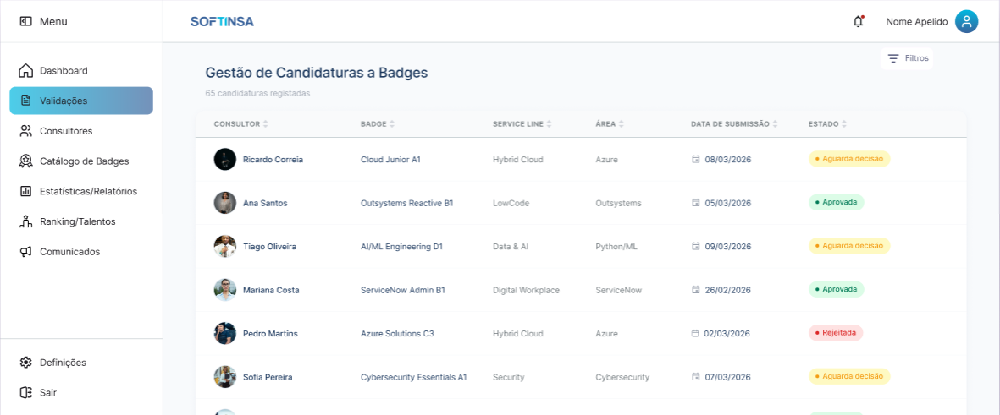
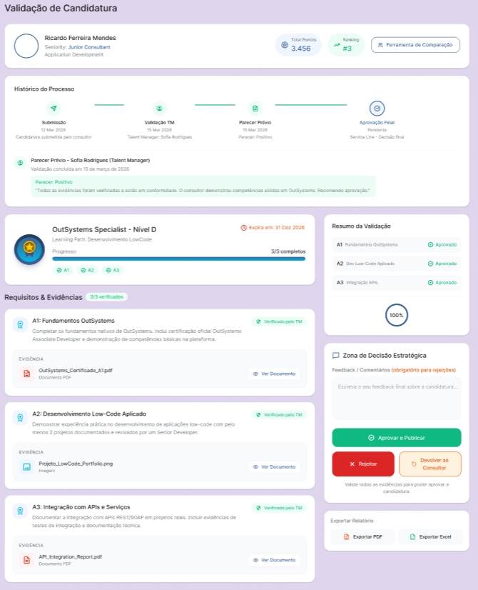

# 2. Requisitos do Sistema e Abordagem

Nesta secção, deves mapear como interpretaste as regras do Enunciado_PINT.pdf e as dividiste sob a ótica da engenharia de software.

## 2.1. Requisitos Funcionais (RF)

Listagem direta das ações que as plataformas (Web e Mobile) permitem fazer.
Podes dividi-los sumariamente pelas necessidades essenciais de cada ator (Consultor, Administrador, Talent Manager e Service Line Leader), focando-te apenas no que foi considerado fundamental e implementado (como o login, submissão de evidências, fluxo de estados e visualização de dashboards).

## 2.2. Requisitos Não Funcionais (RNF)

- **Segurança:** Uso de HTTPS para comunicação segura e encriptação/regras de validação de credenciais (como a obrigatoriedade de alteração de password no primeiro acesso e validação visual de erros a vermelho).
- **Usabilidade e Responsividade:** Interface adaptada tanto para desktop como para dispositivos móveis.
- **Escalabilidade:** Capacidade da arquitetura suportar a introdução de novos Learning Paths no futuro (como as Power Skills).
- **Internacionalização:** Suporte para múltiplos idiomas (Português, Inglês e Espanhol).

---

# 3. Arquitetura de Informação e Modelo de Dados

Uma visão muito breve de como a informação foi estruturada nos bastidores para suportar o negócio da Softinsa.

## 3.1. Estrutura Hierárquica

Explicação sucinta de como geraste a árvore de dados exigida: Learning Path → Service Lines → Áreas → Níveis → Requisitos.

## 3.2. Modelo de Dados (Diagrama Entidade-Associação / Relacional)

- Inclusão do diagrama da Base de Dados (tabelas de utilizadores, perfis, badges, candidaturas, requisitos e logs de auditoria).
- Breve descrição das relações fundamentais (ex: como uma candidatura associa um Consultor a um Badge e armazena as evidências e o estado atual).

---

# 4. Prototipagem e Design de Interface (Figma)

O elo de ligação entre os requisitos e o produto final. Aqui demonstras o aspeto visual e a experiência do utilizador planeada.

## 4.1. Conceito de Design e UI/UX

Descrição do estilo visual adotado no Figma (alinhamento com a identidade da Softinsa, escolha de cores para estados, etc.).

## 4.2. Demonstração de Ecrãs Chave

De seguida, apresentam-se os protótipos de alta fidelidade desenvolvidos em Figma para os ecrãs mais representativos da plataforma, organizados por papel de utilizador e por plataforma (Web e Mobile). Cada ecrã ilustra decisões de layout, hierarquia visual e fluxos de interação que orientaram a implementação final.

### 4.2.1. Ecrãs do Administrador (Web)

**Gestão de Learning Path**

*Figura X — Protótipo do ecrã de perfil e edição de um Learning Path.*

Este protótipo apresenta o ecrã de gestão de um Learning Path individual na perspetiva do Administrador. O painel central exibe a imagem identificativa do Learning Path, o seu nome e uma descrição textual detalhada. Na zona inferior do cartão principal, disponibilizam-se ações de gestão: visualização da pontuação associada, edição do Learning Path, adição de novas Service Lines, exportação dos dados e eliminação da entidade. Na zona direita, quatro cartões de KPI resumem os indicadores associados ao Learning Path — número de consultores ativos, candidaturas pendentes, SLAs ativos e avisos destinados —, permitindo ao Administrador uma leitura rápida do estado operacional. A barra lateral esquerda reflete a navegação administrativa completa, com destaque visual para a secção ativa ("Gerir Estrutura").

**Gestão de SLAs**

*Figura X — Protótipo do ecrã de listagem e gestão de SLAs.*

O protótipo ilustra o ecrã de gestão de Service Level Agreements (SLAs) acessível ao Administrador. No topo, um contador indica o total de SLAs registados na plataforma, acompanhado de um botão de criação de novo SLA. Uma barra de pesquisa e um botão de filtros avançados permitem a localização rápida de registos. Cada cartão de SLA apresenta o nome, a Service Line associada, uma descrição, um indicador visual de estado (pill "Ativo" em verde), os destinatários (número de Service Lines abrangidas, com os nomes listados em chips), e as datas inicial e final do acordo. Esta estrutura em cartões com informação condensada permite ao Administrador gerir de forma eficiente os prazos e âmbitos de resposta definidos para os diferentes fluxos de validação.

### 4.2.2. Ecrãs do Consultor (Web)

**Lista de Candidaturas**

*Figura X — Protótipo do ecrã "As minhas candidaturas" do Consultor.*

Este ecrã apresenta a vista consolidada de todas as candidaturas a badges submetidas pelo Consultor. O layout adota uma grelha de cartões (duas colunas em desktop) onde cada cartão exibe a imagem do badge, o nome ("React Avançado"), a data de submissão e o estado atual da candidatura com codificação cromática e iconográfica — verde com ícone de check para "Aprovado", vermelho com ícone de cruz para "Rejeitada", laranja para "Pendente no Service Line Leader", entre outros. Um indicador temporal ("Há 3 dias", "Há 2 horas pelo Talent Manager") fornece contexto adicional sobre a última atualização. No topo, uma barra de pesquisa e controlos de filtragem e ordenação permitem ao Consultor localizar rapidamente candidaturas específicas. O cartão de pontos na TopBar (3750 pontos) reforça a componente de gamificação presente em toda a experiência do Consultor.

**Histórico de Pontos — Métricas e Estatísticas**

*Figura X — Protótipo do ecrã de Pontos do Consultor — secção superior com métricas e estatísticas.*

A secção superior do ecrã de Pontos apresenta ao Consultor uma visão analítica da sua atividade de gamificação. O painel principal contém um gráfico de barras verticais com a evolução mensal dos pontos acumulados (de Setembro a Fevereiro), acompanhado de um seletor de periodicidade (Semanal). À direita, um gráfico de linha com área preenchida ilustra a atividade semanal distribuída pelos dias (Segunda a Domingo), complementado por um heatmap de atividade das últimas 4 semanas organizado numa grelha de 7 colunas (dias) por 4 linhas (semanas), onde a intensidade da cor indica o volume de atividade por dia. Na zona inferior, dois cartões destacam o próximo objetivo recomendado pelo sistema de recomendação (ex: "IBM Cloud Kubernetes Service" com indicação de pontos, tempo estimado e nível) e as conquistas especiais do Consultor (certificações pagas com bónus de pontos associados).

**Histórico de Pontos — Tabela Detalhada**

*Figura X — Protótipo do ecrã de Pontos do Consultor — secção inferior com histórico detalhado.*

A secção inferior do mesmo ecrã complementa as métricas visuais com informação tabular detalhada. Os cartões de recomendação e conquistas especiais mantêm-se visíveis, seguidos de uma tabela de "Histórico de Pontos" com colunas de data, badge/requisito (nome do badge e responsável pela validação), Service Line, Área, pontos atribuídos e estado (pill colorido indicando "Verificado pelo Talent Manager"). A tabela inclui funcionalidades de pesquisa, filtragem e exportação de dados, proporcionando ao Consultor rastreabilidade completa sobre a origem de cada parcela de pontos acumulados ao longo do tempo.

### 4.2.3. Ecrãs do Consultor (Mobile)

**Detalhe de Candidatura — Estado e Informações**

*Figura X — Protótipo do ecrã de detalhe de candidatura na aplicação móvel (parte superior).*

Este protótipo ilustra a vista de detalhe de uma candidatura a badge na aplicação móvel do Consultor. No topo, um stepper horizontal com ícones de progresso apresenta visualmente as fases do fluxo de aprovação — "Enviado", "TM" (Talent Manager) e "Service Line Leader" —, com indicadores de conclusão (checks verdes) e a fase atual destacada. Abaixo, a secção "Últimas atualizações" mostra o estado corrente ("Em revisão pelo Service Line Leader") com timestamp, seguida de uma secção de "Observações" com o feedback textual deixado pelo Talent Manager. A secção "Informações sobre o badge" apresenta os metadados do badge num formato compacto de lista chave-valor: Learning Path, Tipo de Badge, Nível, Service Line, Área, Pontos e Tempo de obtenção estimado — adaptado à largura reduzida do ecrã móvel.

**Detalhe de Candidatura — Ficheiros e Requisitos**

*Figura X — Protótipo do ecrã de detalhe de candidatura na aplicação móvel (parte inferior).*

A continuação do ecrã móvel de candidatura mostra os campos adicionais de informação do badge (Service Line, Área, Pontos, Tempo de obtenção estimado e Data de expiração), seguidos da zona de interação com ficheiros. Um botão "Anexar ficheiro" com indicação do tamanho máximo permitido (500MB) precede a lista de ficheiros já anexados, cada um com nome, associação ao requisito correspondente e ações de ligação e remoção. Na zona inferior, uma secção colapsável de "Requisitos" lista os requisitos do badge em formato de acordeão (expandível por toque), e um carrossel horizontal de "Badges semelhantes" sugere badges relacionados (ex: "Master of HTML", "PHP intermedi...", "Master of JS") com as respetivas áreas, promovendo a descoberta de novos percursos de aprendizagem.

### 4.2.4. Ecrã do Talent Manager (Web)

**Quadro de Validações**

*Figura X — Protótipo do ecrã de gestão de candidaturas a badges do Talent Manager.*

O protótipo apresenta o quadro de validações do Talent Manager, onde são listadas todas as candidaturas a badges submetidas pelos consultores. A interface adota um formato tabular com colunas de Consultor (avatar + nome), Badge (nome completo com nível), Service Line, Área, Data de Submissão e Estado. Cada linha é clicável, permitindo o acesso ao ecrã de revisão detalhada. Os estados são representados por pills coloridas — "Aguarda decisão" (laranja), "Aprovada" (verde) e "Rejeitada" (vermelho) —, proporcionando uma leitura visual imediata da fila de trabalho. Um contador no cabeçalho ("65 candidaturas registadas") e um botão de filtros avançados complementam a navegação. A sidebar reflete o menu específico do Talent Manager, incluindo secções de Dashboard, Validações, Consultores, Catálogo de Badges, Estatísticas/Relatórios e Ranking/Talentos.

### 4.2.5. Ecrã do Service Line Leader (Web)

**Validação de Candidatura**

*Figura X — Protótipo do ecrã de avaliação de uma candidatura a badge pelo Service Line Leader.*

Este protótipo ilustra o ecrã de revisão detalhada de uma candidatura na perspetiva do Service Line Leader, o aprovador final do fluxo. O layout divide-se em múltiplas secções: no topo, o perfil do consultor candidato (nome, Service Line, pontos acumulados e número de badges) com um botão de comparação com pares. Segue-se o "Histórico do Processo" com uma timeline visual dos passos já percorridos, incluindo o parecer do Talent Manager com data e observações ("Todos os certificados foram verificados..."). A secção central apresenta o cartão do badge em avaliação (nome, data, barra de progresso dos requisitos concluídos). A secção "Requisitos & Evidências" lista cada requisito com a sua descrição, ficheiros de evidência anexados e ações de validação. Na zona direita, um painel de "Resumo de Validação" e uma "Zona de Decisão Estratégica" permitem ao Service Line Leader registar feedback, comentários obrigatórios e tomar a decisão final — aprovar e publicar o badge, rejeitar definitivamente ou devolver ao Consultor para retificação.

---

# 5. Workflow de Aprovação e Ciclo de Vida do Pedido

Explicação detalhada de como o sistema reflete o fluxo dinâmico estipulado no enunciado, detalhando a transição de estados através das ações dos utilizadores.

## 5.1. Submissão (Consultor)

O utilizador anexa as evidências externas, alterando o estado do pedido de Open para Submitted.

## 5.2. Triagem e Validação de Evidências (Talent Manager)

Avaliação global das evidências submetidas, com transição para Em Validação (se correto) ou retorno a Open (se incorreto para retificação), garantindo o registo auditável de quem avaliou e quando.

## 5.3. Homologação Final (Service Line Leader)

Validação restrita aos colaboradores da sua área, culminando no estado Fechado (quer por aprovação/publicação do badge ou rejeição definitiva) ou Open (via Send Back com comentários).

---

# 6. Funcionalidades Transversais Implementadas

Foco nas lógicas de suporte e negócio que foram integradas no sistema core.

## 6.1. Mecânicas de Gamificação

Como funciona o sistema de atribuição de pontos gerido pelo Administrador, a acumulação no perfil do consultor e a regra de retenção de pontos mesmo após a expiração de um badge.

## 6.2. Módulo de Estatísticas e Reporting

Demonstração dos ecrãs que geram as métricas mínimas exigidas (visão mensal de badges, volume por ranges de datas, contagem por níveis/learning paths e utilizadores registados).

---

# 7. Extras e Funcionalidades Bónus

Destaque para o valor acrescentado que eleva a qualidade do projeto face ao enunciado original.

## 7.1. Sistema de Saudações Inteligente

Demonstração da lógica multi-idioma que saúda o utilizador com base na hora do dia ("Bom dia/Tarde/Noite") ou deteta ausências superiores a 15 dias ("Seja bem-vindo novamente").

## 7.2. Mural de Avisos e Comunicação

Espaço gerido pelos administradores para publicação imediata de informações genéricas a todos os utilizadores.

## 7.3. Alertas de SLA e Notificações

Mecanismo (PUSH ou email) que avisa os validadores ou gestores quando os prazos de resposta a pedidos são ultrapassados.
